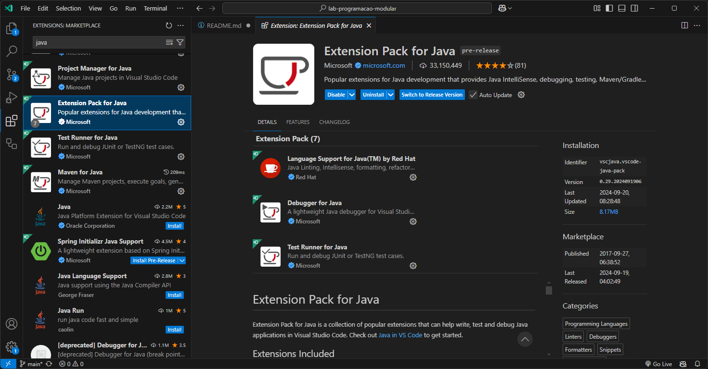

# Roteiro de Laboratório: Utilizando Maven para Criar um Projeto Java no Visual Studio Code

## Autor: Hugo de Paula


Objetivo é introduzir os alunos ao uso do Maven como ferramenta de *build automation* para projetos Java usando o VS Code. 

**Competências a serem desenvolvidas:**

- Criar e configurar um projeto Maven com Java no VS Code.
- Configurar um projeto Maven a partir do arquivo `pom.xml`

---

### Build Automation Tools

Build Tools são ferramentas que automatizam o processo de gerenciamento de dependências, compilação, empacotamento, teste e implantação (*deploy*) de software. 

**Características:**

- **Gerenciamento de Dependências:** Automatiza a inclusão de bibliotecas externas necessárias para o projeto.
- **Compilação:** 
- **Empacotamento:** Gera arquivos JAR, WAR, etc.
- **Testes Automatizados:** Executa testes unitários e de integração.
- **Implantação:** Facilita a distribuição do software em diferentes ambientes.

**Exemplos de Build Tools:**

- **Maven**
- **Gradle**
- **Ant**

---

### Maven

Maven é uma ferramenta de automação de build e gerenciamento de projetos baseada no conceito de Project Object Model (POM). Ele usa um arquivo XML (`pom.xml`) para descrever o projeto, suas dependências, e como ele deve ser construído.

**Características do Maven:**

- **Convenção sobre Configuração:** Maven segue convenções que reduzem a necessidade de configuração explícita.
- **Gerenciamento de Dependências:** Facilita a inclusão e atualização de bibliotecas externas.
- **Ciclo de Vida de Build:** Define fases como compilação, teste, empacotamento, e implantação.
- **Plugins:** Extensível através de plugins para adicionar funcionalidades.

---

### Instalação e Configuração do Maven

#### **Instalação do Maven:**

1. **Baixar o Maven:** Acesse o site oficial do Maven ([https://maven.apache.org/download.cgi](https://maven.apache.org/download.cgi)) e baixe a versão mais recente e extraia o conteúdo em uma pasta cujo caminho não contenha espaços.

2. **Configurar Variáveis de Ambiente:**
   - **Windows:**
     - Adicione o diretório `bin` do Maven à variável de ambiente `PATH`.
     - Exemplo: `C:\apache-maven\bin`
   - **Linux/Mac:**
     - Adicione o diretório `bin` ao `PATH` no arquivo `.bashrc` ou `.zshrc`.
     - Exemplo: `export PATH=$PATH:/opt/apache-maven/bin`

3. **Verificar Instalação:**
   - Abra o terminal e execute o comando:
     ```bash
     mvn -v
     ```
   - Isso deve exibir a versão do Maven instalada.

4. **Instalação das extensões do VS Code**
   - Instale o Extension Pack for Java da Microsoft. Ele irá instalar 9 extensões para desenvolvimento Java, incluindo o suporte ao Maven.



---

### Criando um Projeto Java com Maven no Visual Studio Code

#### **A partir do command palette**

1. Abra o command palette (`Ctrl + Shft + P`).

2. Selecione: `Java: Create Java Project`


3. Selecione o **Maven** como *build tool*.


4. Selecione a opção `No Archetype`.


---

#### **A partir do terminal**


1. Abra o terminal integrado (`Ctrl + ``).

2. Execute o seguinte comando para criar um projeto Maven:
   ```bash
   mvn archetype:generate -DgroupId=com.exemplo -DartifactId=meu-projeto -DarchetypeArtifactId=maven-archetype-quickstart -DinteractiveMode=false
   ```
   - `groupId`: Identificador do grupo (ex: `br.lpm`).
   - `artifactId`: Nome do projeto (ex: `meu-projeto`).

---

### Entendendo o Arquivo `pom.xml`

#### **Estrutura Básica do `pom.xml`:**

```xml
<project xmlns="http://maven.apache.org/POM/4.0.0"
         xmlns:xsi="http://www.w3.org/2001/XMLSchema-instance"
         xsi:schemaLocation="http://maven.apache.org/POM/4.0.0 http://maven.apache.org/xsd/maven-4.0.0.xsd">
    <modelVersion>4.0.0</modelVersion>
    <groupId>com.exemplo</groupId>
    <artifactId>meu-projeto</artifactId>
    <version>1.0-SNAPSHOT</version>
    <properties>
        <maven.compiler.source>17</maven.compiler.source>
        <maven.compiler.target>17</maven.compiler.target>
    </properties>
    <dependencies>
        <!-- Dependências serão adicionadas aqui -->
    </dependencies>
</project>
```

#### Atualizando a Versão do Java:

No arquivo `pom.xml`, localize a seção `<properties>` e defina as versões do compilador:
  ```xml
  <properties>
      <maven.compiler.source>23</maven.compiler.source>
      <maven.compiler.target>23</maven.compiler.target>
      <maven.compiler.release>23</maven.compiler.release>
  </properties>
  ```

#### Adicionando Dependências (JUnit 5)

Adicione as dependências da JUnit 5 ao `pom.xml`, na seção `<dependencies>`:
  ```xml
  <dependency>
      <groupId>org.junit.jupiter</groupId>
      <artifactId>junit-jupiter-api</artifactId>
      <version>5.12.0-M1</version>
      <scope>test</scope>
  </dependency>
  <dependency>
      <groupId>org.junit.jupiter</groupId>
      <artifactId>junit-jupiter-engine</artifactId>
      <version>5.12.0-M1</version>
      <scope>test</scope>
  </dependency>
  ```

No terminal, execute:
  ```bash
  mvn clean install
  ```

---

### Desenvolvendo Algoritmos em Java

**Atividade Prática:**
1. Crie uma classe `Calculadora` no diretório `src/main/java/br/lpm`.

2. Implemente os seguintes métodos:
   - `int somar(int a, int b)`
   - `int subtrair(int a, int b)`
   - `int multiplicar(int a, int b)`
   - `double dividir(int a, int b)`

3. Crie testes unitários para cada método na classe `CalculadoraTest` no diretório `src/test/java/br/lpm`.
4. Execute os testes com o comando:
   ```bash
   mvn test
   ```

**Exemplo de Código:**
```java
// src/main/java/br/lpm/Calculadora.java
package br.lpm;

public class Calculadora {
    public int somar(int a, int b) {
        return a + b;
    }

    public int subtrair(int a, int b) {
        return a - b;
    }

    public int multiplicar(int a, int b) {
        return a * b;
    }

    public double dividir(int a, int b) {
        if (b == 0) {
            throw new IllegalArgumentException("Divisor não pode ser zero");
        }
        return (double) a / b;
    }
}
```

```java
// src/test/java/br/lpm/CalculadoraTest.java
package br.lpm;

import org.junit.jupiter.api.Test;
import static org.junit.jupiter.api.Assertions.*;

public class CalculadoraTest {

    @Test
    public void testSomar() {
        Calculadora calc = new Calculadora();
        assertEquals(5, calc.somar(2, 3));
    }

    @Test
    public void testSubtrair() {
        Calculadora calc = new Calculadora();
        assertEquals(1, calc.subtrair(3, 2));
    }

    @Test
    public void testMultiplicar() {
        Calculadora calc = new Calculadora();
        assertEquals(6, calc.multiplicar(2, 3));
    }

    @Test
    public void testDividir() {
        Calculadora calc = new Calculadora();
        assertEquals(2.5, calc.dividir(5, 2));
    }

    @Test
    public void testDividirPorZero() {
        Calculadora calc = new Calculadora();
        assertThrows(IllegalArgumentException.class, () -> {
            calc.dividir(5, 0);
        });
    }
}
```
